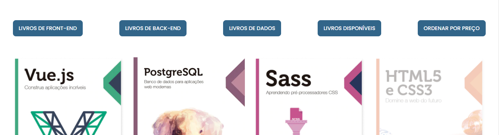
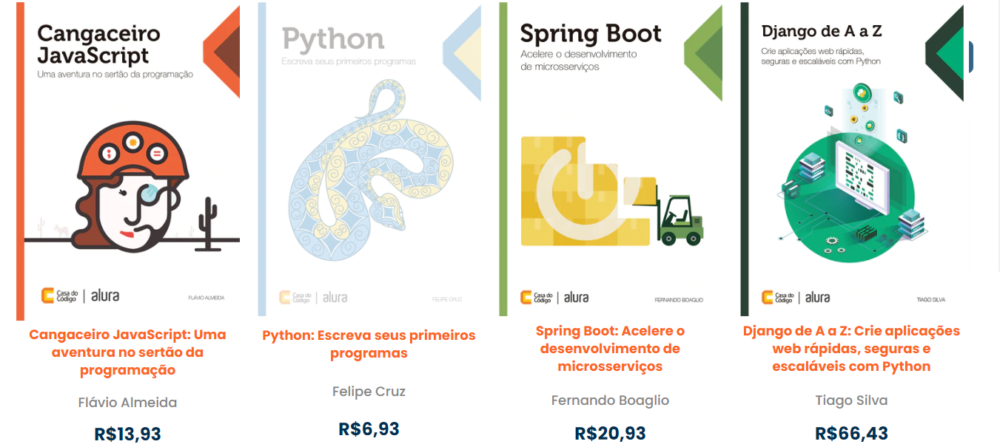
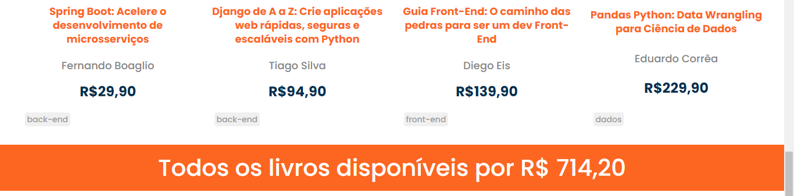

## Welcome! 👋

# Bookstore filters

This is a code from [Alura](https://www.alura.com.br). In this course, I learned how to manipulate DOM with JavaScript, create filters, and some new JS methods.

### Screen Shots
- Filter Buttons


- Avaliable Books with discount price applied


- Total price of avaliable books


## Some code that I'm proud of
```js
function exibirOsLivrosNaTela(listaDeLivros) {
  const elementoComValorTotalDeLivrosDisponiveis = document.getElementById('valor_total_livros_disponiveis')
  elementoComValorTotalDeLivrosDisponiveis.innerHTML = ''
  elementoParaInserirLivros.innerHTML = ''  
  listaDeLivros.forEach(livro => {
      let disponibilidade = livro.quantidade > 0 ? 'livro__imagens' : 'livros__imagens indisponivel'
      elementoParaInserirLivros.innerHTML += `
      <div class="livro">
      
      <h2 class="livro__titulo">
        ${livro.titulo}
      </h2>
      <p class="livro__descricao">${livro.autor}</p>
      <p class="livro__preco" id="preco">R$${livro.preco.toFixed(2).toString().replace(".", ",")}</p>
      <div class="tags">
        <span class="tag">${livro.categoria}</span>
      </div>
      `
    })
}
```

## Built with

- Semantic HTML5;
- CSS custom properties;
- JavaScript;
- Reduce;
- Filter;
- For Each;
- Map;
- Sort.


## Test the project yourself: [Teste the project here!!!](https://bookstore-fawn-seven.vercel.app/)

### You can:

- Filter books using the buttons;
- See the avaliable books without oppacity;
- Filter the avaliable books and see the total price of them;
- Sort by price;
- Use API to update the avaliable books.

## Author

- Website - [My GitHub](https://github.com/lucasbailo)
- Frontend Mentor - [@lucasbailo](https://www.frontendmentor.io/profile/lucasbailo)
- Instagram - [@lucassbailo](https://www.instagram.com/lucassbailo/)
- LinkedIn - [Lucas Bailo](https://www.linkedin.com/in/lcsbailo)